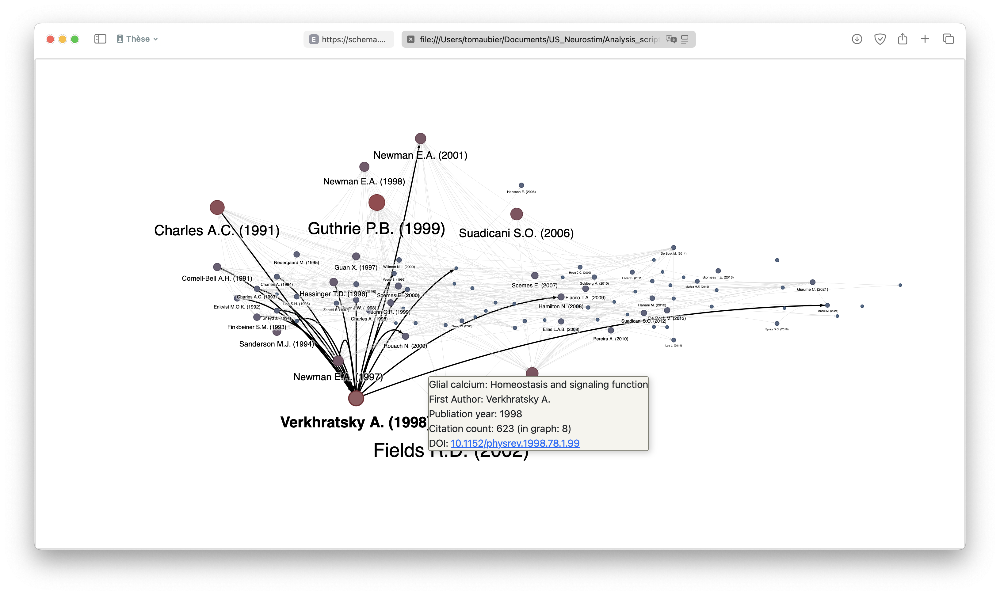
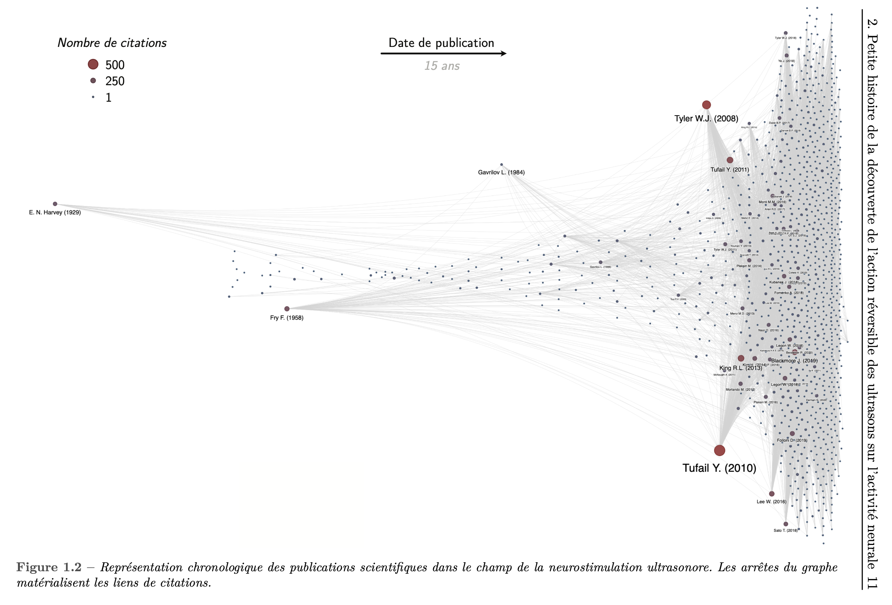

# Citation-Graph-Builder

Create and explore scientific publication timelines interactively using the [Scopus API](https://pybliometrics.readthedocs.io/en/stable/) and [pyviz](https://pyvis.readthedocs.io/en/latest/).

This script was developed in the context of my PhD thesis with the aim of identifying the main questions that have historically structured the field of research in ultrasound neurostimulation and neuromodulation.

## Installation and Usage

Tested using Python 3.12

0. Create a new environnement (optional but recommended) using `conda` -> `conda create -n literature_graph_env python=3.12`
1. Activate environnement (`conda activate literature_graph_env`) and install required Python packages (`pip install -r requirements.txt`)
2. Try out the example provided in `citation_graph_builder.ipynb`